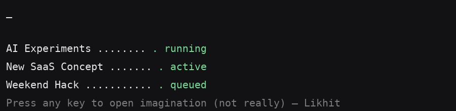

<!-- Typing Intro -->
<h1 align="center">
  
</h1>

---

## About Me

I’m a **Software Developer** passionate about **data-driven solutions, scalable systems, and clean design**.  
I thrive at the intersection of analysis, development, and innovation.

- 🔎 Specialized in **analyzing systems** and **building end-to-end solutions**  
- 📊 Experienced with **Building Saas Applications, Provide Products and services**  
- 🤝 Open to **collaboration on impactful projects**  
- 📄 [Resume](https://www.linkedin.com/in/likhit-kumar/)  

---

## What's Running in My Head

  

---

## Tech Stack  

  <!-- Programming Languages -->
  
  
  
  
  
  

  <!-- Frontend -->
  
  
  
  
  
  

  <!-- Backend -->
  
  
  

  <!-- Databases -->
  
  
  
  

  <!-- Tools & DevOps -->
  
  
  
  

---

## Contribution

  

---

## 📫 Let’s Connect  

  
  
  

